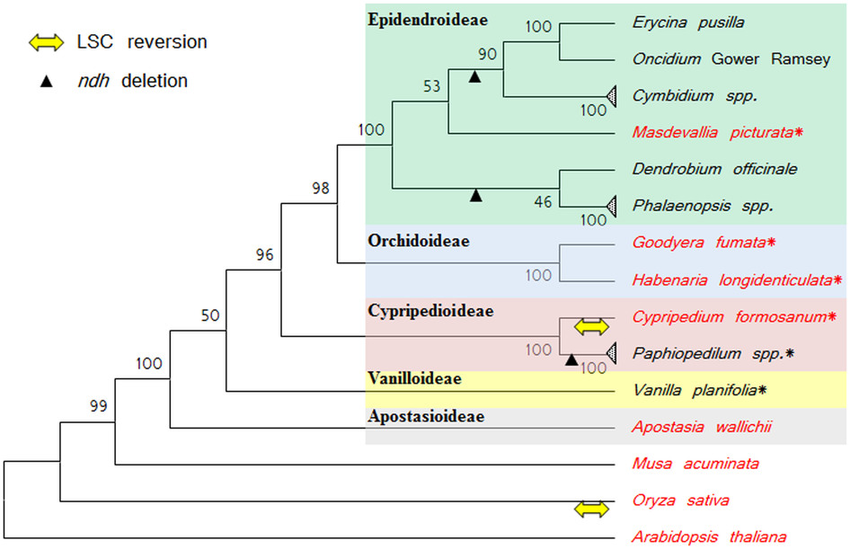
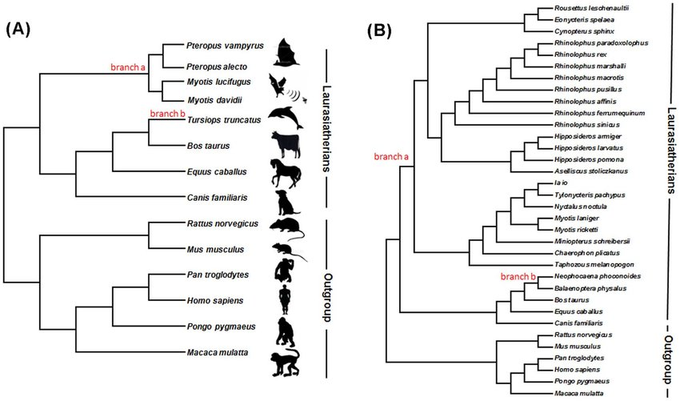
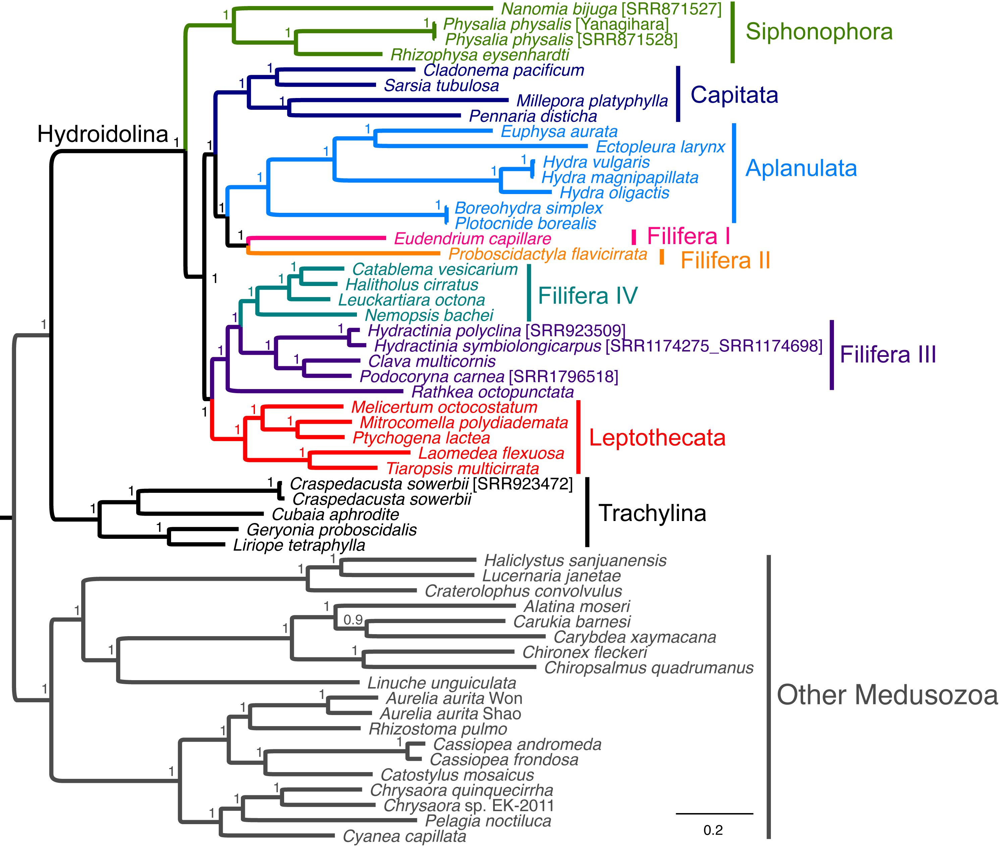
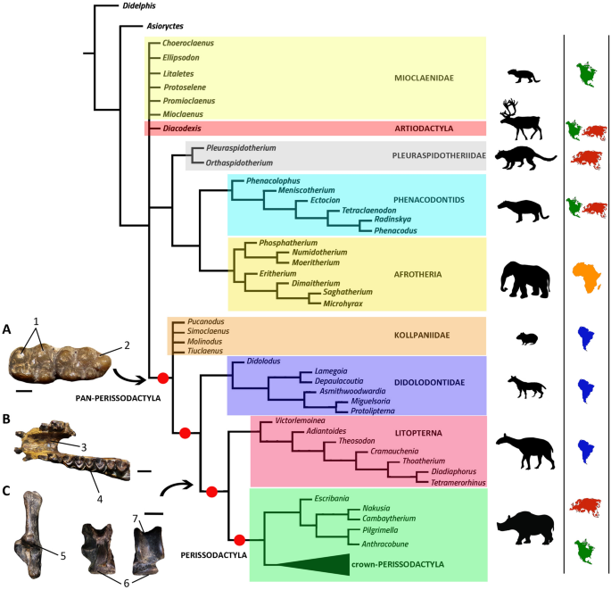

# Session 4 - Phylogenetic Analysis

## Introduction

Since the inception of Biology, one of the key questions scientists have aimed to answer is "How do different organisms relate to each other?" and "How have they evolved?". Initially, biologists used anatomical similarities and differences to reconstruct the evolutionary relationship between species. With the dawn of genetic sequencing, we can now describe these relationships quite more accurately. The practice of using genetic data to infer phylogenetic relationships is known as Phylogenetics, and the way of visualizing such relationships are [phylogenetic trees](https://en.wikipedia.org/wiki/Phylogenetic_tree).

<div align="center">
  
</div>

**Figure 4. The principle of homology in vertebrate limbs**  
Author: Волков Владислав Петрович | CC BY-SA 4.0

The underlying idea behind phylogenetics is quite simple. As populations diverge from each other, they accumulate mutations that are exchanged between individuals of the same population but not with other groups. Over time, different mutations have accumulated in different populations, so that when comparing their genomes, they are easily distinguishable. The larger the number of differences between genomes of two populations, the longer the time since they shared a common ancestor. The distinction between populations and species is not very well defined, and speciation is a long and continuous process that may or may not lead to two (or more) completely isolated species. Additionally, individuals of one species are not identical but rather show some degree of genetic diversity between them. Because of this, phylogenetic analyses of distantly related species can often rely on a single genome per species, while the analysis of more closely related species or populations might require sequencing a few individuals per group.


<div align="center">
  
</div>

**Figure 5. A phylogenetic tree of wolves**  
Authors: [Ersmark *et al*. (2016)](https://doi.org/10.3389/fevo.2016.00134)

Modern phylogenetics often uses large amounts of data and increasingly complicated models and algorithms. In these approaches, each generated tree is a hypothesis of the relationship between genomic sequences, and the goal is often to identify the best tree. What "best" means is defined by different criteria depending on the tree-building algorithm used. A small summary of different statistical approaches to phylogenetics is provided later in this session.


### Goals

+ Test which substitution model works best with your data
+ Work with `IQTree` and learn how to extract information from its output
+ Create a phylogenetic tree that is meaningful for your project's question

### Input

+ Aligned fasta sequences of the complete mitochondrial DNA and *CytB* gene


### Output(s)

+ `IQ-TREE` file with relevant info on your tree
+ Tree file
+ Image files of your trees


### Tools

+ Maximum Likelihood tree-building software [IQ-TREE](http://www.iqtree.org/)
+ Phylogenetic tree visualisation software [FigTree](https://tree.bio.ed.ac.uk/software/figtree/)


## Inferring phylogenetic relationships

Deciding which phylogentic tree is the best is not straight forward. Below are some methods:

+ [Parsimony](https://www.mun.ca/biology/scarr/2900_Parsimony_Analysis.htm): "**the simplest tree that can explain the data is to be preferred**", so the hypothesis with the smallest number of changes is the most likely. However, this method has plenty of assumptions that we know are false, so it is generally not used anymore.
+ [Neighbour-joining](https://academic.oup.com/mbe/article/4/4/406/1029664): A slightly more refined version of parsimony in which we chose the best tree by **minimizing branch lengths** in the tree. More computationally intensive than parsimony, but still something that a modern computer can do fairly quickly.
+ [Maximum Likelihood](http://ib.berkeley.edu/courses/ib200a/lect/ib200a_lect11_Will_likelihood.pdf): "Likelihood is defined to be a quantity proportional to the probability of observing the data given the model". This means that, **by providing a model of how DNA sequences change, we can determine which tree is the most probable to be true**. 
+ [Bayesian Inference](https://www.sciencemag.org/site/feature/data/1050262.pdf): This method uses Bayesian Statistics to combine **prior information** that we know about our data (also known as Prior Probability Distribution) **with the likelihood**, in order to transform it into a more accurate probability distribution, known as the **Posterior**.

The last two are the state-of-the-art methods for phylogenetic tree reconstruction, and have become more popular as computing power has increased, as both methods are very demanding in that regard. 

In this project, you are going to use an implementation of the Maximum Likelihood approach called [IQ-TREE](http://www.iqtree.org/doc/Tutorial#first-running-example). As mentioned earlier, any Maximum Likelihood approach is **based on a model**. In phylogenetics, this model describes the probability of each substitution to happen. [Here](http://evomics.org/resources/substitution-models/nucleotide-substitution-models/) you can find a list of the more common models, and [here](http://www.iqtree.org/doc/Substitution-Models) the ones that are implemented in `IQ-TREE`. 


<div align="center">
  
</div>

**Figure 6. Prior, likelihood and posterior distribution for a two-parameter phylogenetic example**  
Authors: [Nascimento *et al*. (2017)](https://dx.doi.org/10.1038%2Fs41559-017-0280-x)


<div align="center">
  
</div>

**Figure 7. Graphical representation of three substitution models**  
Authors: [Yang & Rannala (2012)](https://doi.org/10.1038/nrg3186)


## Generating Maximum Likelihood trees

Let's start working with `IQ-TREE`. The basic syntax for this software is:

```ruby
iqtree -s <YOUR_ALIGNMENT> -o <YOUR_OUTGROUP> -m <ONE_MODEL> -pre <OUTPUT_PREFIX> -bb 1000
```

Replace the capitalized variables with your choices, e.g. replace `ALIGNMENT` with the name of your aligned fasta file for the *CYTB* gene. 

For `OUTGROUP`, you should write the **name of your outgroup** as they appear in the alignment file. If you have multiple outgroups, you can separate them with a comma (**make sure to have no spaces as separators!**), e.g.: ```-o C_vurs,H_sap```

Now run `IQ-TREE` in your terminal with the *CYTB* data, and set your model to `-m MFP`. `MFP` stands for Model Finder Plus, which is an algorithm that automatically considers a list of substitution models and estimates which model fits best the data. 

The `-bb 1000` option will force the algorithm to use [bootstrapping](https://en.wikipedia.org/wiki/Bootstrapping_(statistics)) with 1,000 samples. 

### Model selection

In phylogenetics, an evolutionary model describes how DNA, RNA or protein sequences change over time. Choosing an appropriate model is crucial because Maximum Likelihood methods rely on an explicit model to estimate branch lengths and tree topology. `IQ-TREE` automates this process through its integrated `MFP` option.

1. For each candidate model, `IQ-TREE` computes the Maximum Likelihood of the data under that model.
2. `IQ-TREE` then evaluates models using statistical criteria that penalize model complexity, typically:
   - BIC (Bayesian Information Criterion)
   - AIC (Akaike Information Criteria)
3. Lower values in these statistics indicate better model fit.
4. Often the model with the lowest BIC (or another criterion) is selected for the final Maximum Likelihood tree reconstruction.

The selected model reflects the substitution patterns and rate heterogeneity best supported by the data. A better-fitting model generally yields more accurate branch lengths, likelihoods, and often more reliable topology. A model like `GTR+F` indicates:

- `GTR`: The substitution matrix "general time-reversible" was used.
- `+F`: Empirical base frequencies were estimated from the alignment.

### Bootstrapping

Bootstrap values in phylogenetic trees are a measure of how strongly the data supports each branch (or clade) in the tree. They are used to assess the reliability of the inferred evolutionary relationships. Bootstrap values are percentages (0-100) that indicate how often a particular clade appears when the dataset is repeatedly resampled and reanalyzed. A higher value (e.g., 90–100) suggests a strong support for that branch, while lower values (e.g., <70) suggest weaker or uncertain support. This is a summary of how they are calculated:

1. The original sequence alignment is randomly resampled with replacement to create many "bootstrap replicate" datasets (often hundreds or thousands). Each of these replicates contains randomly selected positions in the alignment (e.g. positions 1, 35, 82, 3, 45, 75, 75, 48, 24). 
2. A phylogenetic tree is reconstructed from each replicate using the same tree-building method (e.g., maximum likelihood, neighbor-joining).
3. For each branch in the original tree (the one that uses the complete alignment), the proportion of replicate trees that contain that very same clade is calculated.
4. This proportion is reported as the bootstrap value (e.g., a clade that appears 85% of the times will have a value of 85).

Bootstrap values reflect a measure of consistency: how stable a clade is under small perturbations (random subsampling) of the alignment. They do not measure truth directly, but rather how robust the inference is given the data and the model used.

## Visualizing Maximum Likelihood trees

In the `.iqtree` file, you have a representation of the trees. However, these are unrooted trees. You can root the tree and customise its appearance with the program `FigTree`. Rooting a tree is important for interpretability and the directionality of evolution. Unrooted trees can be useful for some purposes, but cannot be used to answer the research questions in your projects. `IQ-TREE` creates several types of trees (e.g. a Neighbour Joining tree saved as `.bionj` file and an Maximum Likelihood tree saved as `.treefile`).

Log in to Solander with `ssh -X` flag, which allows to use the monitor to Solander and type:

```ruby
java -jar <PATH_TO_FIGTREE_FILE>
```
or
```ruby
figtree
```

If you can't get `FigTree` to work through the terminal you can download it from [here](https://github.com/rambaut/figtree/releases) and install it locally on your computer. It's very simple to run.

When you call `FigTree`, a visual interface will open. In `File`, choose `Open` and select one of your Maximum Likelihood trees. If the software asks you to select a name for the labels on the tree, you can keep the default or choose a keyword, for example `bootstrap`. **OBS!** You do not want the `.iqtree` file, which is more of a logfile than an actual tree.

Three key things you have to do:
  
1. Root the tree with your known outgroup (select the specific branch and then click `Reroot`).
2. Display the bootstrap values (using `Branch labels` or `Node labels` and selecting the right value to show).
3. Make sure the tree can easily be understood. You might need to change the name of species to common names (not everyone will be familiar with the latin names of your species or the shortenings that you defined in [Session 1](Lab_1.md)).

Once you are done with these steps, you can play around with the other options to make your tree visually more interesting (e.g. `Rotate`, different types of tree dispositions, text colors, branch colors, etc.). Before you export your tree, think about what else you can do to showcase your results better. Look on Google for actually published trees, like the ones shown below:
 
<p float ="left">
	
	
	
	
</p>	

**Figure 8. Graphical representation of three substitution models**  
Authors (top to bottom, left to right): [Lin et al. (2015)](https://doi.org/10.1038/srep09040), [Liang et al. (2013)](https://doi.org/10.1371/journal.pone.0065944), [Kayal et al. (2015)](https://doi.org/10.7717/peerj.1403), [Chimento et al. (2020)](https://doi.org/10.1038/s41598-020-70287-5)


**OBS!** Do not forget to export your trees as image files. You will have to show them during the presentation.

**Question 1**: **Which files does `IQ-TREE` output? Explain briefly what each of them is**.

**Question 2.1**: **Which model did ModelFinder choose? From all the criteria calculated by this software, which was used to determine the best-fitting model?**
**Question 2.2**: **Briefly explain the best-fitting model**.

**Question 3**: **In your tree, you can see a number at the base of each node. That is the number of data partitions that supported that clade during bootstrapping. Which is your least supported node? What does that mean in regards to your research question?**

Repeat these steps for the full mitochondrial genome alignments. Remember to adapt the command above to run `IQ-TREE` and be careful to not over-write your files.

# STUDIUM QUIZZ

Answer all the question in the quizz in Studium only for *CYTB*. Remember to upload the `.iqtree` file in the quizz.
