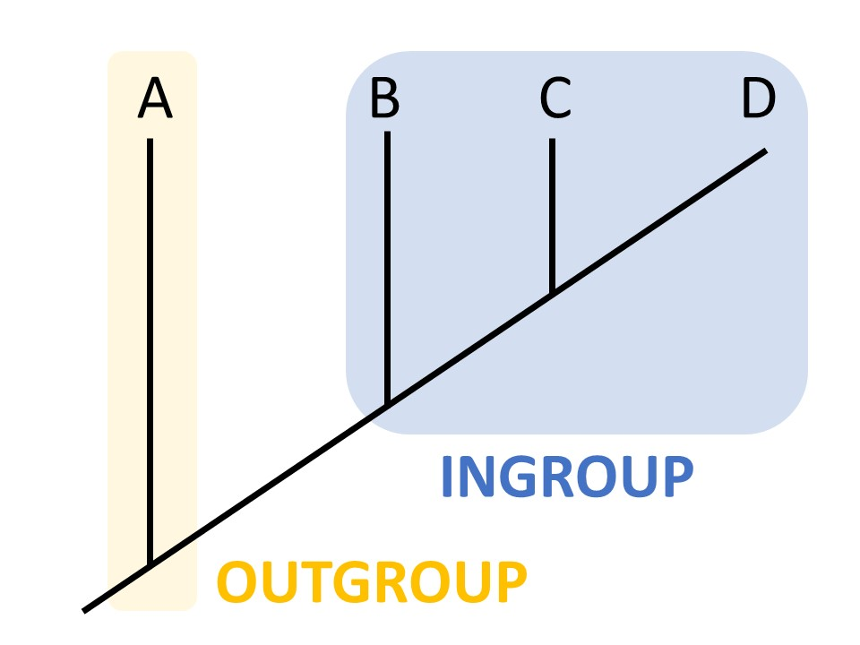

# Real-world phylogenetics

### Solving evolutionary questions

#### 

##### Introduction 

In this project you will perform a complete phylogenetic analysis from gathering the data to interpreting the results. You will work in groups of 2 or 3. Each small group will work on one of eight questions (see below). Questions will be assigned randomly once the groups are formed at the beginning of Tutorial X6. You will try to answer a biological question by analyzing two mitochondrial genes:

1. cytB, coding for the Cytochrome B protein (CYB), that is a heme-binding protein involved in the electron transport of the mitochondrial respiratory chain.

2. 16S, ribosomal 16S gene, a non-coding structual rRNA gene.

   

##### The questions

1. Are bats more closely related to horses than to cows?
2. Do marsupials form a monophyletic group (i.e. clade)?
3. Both whales and dugongs originate from land-living animals. Did this land-to-water transition occur twice independently?
4. Are salamanders more closely related to frogs than to lizards?
5. What are the closest relatives of octopuses and squids?
6. Is the guinea pig more closely related to rats than to pigs?
7. What feline (cat-like animals) is most closely related to the cheetah?
8. Are egg-laying mammals (platypus and echidna) more closely related to marsupials than to placental mammals?

##### Performing the analysis 

You will start with compiling your datasets in lab 5. The following labs, 6 to 8, will introduce different phylogenetic methods, programs and tools that you will apply to the dataset you compiled. You will have to make notes and keep track of intermediate results along the way. Remember that each member of the group should run the analysis. One good effect for you in doing that is that you automatically have built in error checking (hopefully you make different mistakes). OBS! Since you are going to produce quite a lot of files, try to use self-explanatory files names and a good structure of folders. It will make your work easier. It might be a good idea to write a short description (a README file) about how the archive is organized and where the files are (trees, scripts, alignments, etc.).

##### Work on your own dataset

By the end of lab 7, you should have done (for each of your two genes) the following analyses: 

- [ ] A maximum parsimony (MP) tree, using `PAUP*`.Note: Make sure that in your NEXUS data file, datatype is set to dna, not protein. Also make sure that you save your tree(s) including the branch lengths! (savetrees file=tree_file.tre format=phylip brlens;) 
- [ ] A maximum-likelihhod (ML) and a Neighbour-Joining (NJ) tree using `IQTree`, and a ML bootstrap analysis to test the robustness of the selected tree.
- [ ] A Bayesian phylogenetic reconstruction using `BEAST2`. You should use the model of molecular evolution that best corresponds to the model selected by `IQTree` model-selection tool. Note: Make sure that in your NEXUS data file, datatype is set to dna, not protein. 

This list can serve as a potential checklist for you to structure your results that will justify you final answer. 

##### Wrapping-up the project 

At the end of the last lab session we will meet each group individually for short oral examination. You will answer the question you were assigned with the help of results that you obtained during the project. No stress! The point is for you to get to work on a more complex project and to reflect on the results you obtained - caution, they can be contradictory (but not always). The most optimal way to answer your question would be a collection of key findings that led to this specific answer. OBS! This informal presentation is compulsory for us to validate lab 8, so if for some reason you cannot attend the class that day, let us know in advance and we will find a solution.

### Gathering the data 

The first part of this project is to collect a dataset that you will use to perform a phylogenetic analysis for the rest of the course. The complete datasets should contain about 10-15 species including one appropriate outgroup species (a species we know for sure that is basal to anything else in the dataset). When selecting the species, be sure to make a good selection, not too wide and not too narrow. The Taxonomy browser might be of help in the selection (even if it feels like cheating). If possible your two datasets (16S and cytB) should contain genes from the same set of species. Take your time to create the dataset, as it will impact directly whether you can answer the question you were given. You can ask us to validate your choice of species and outgroup.

_By Ngilbert202 - Own work, CC BY-SA 4.0, https://commons.wikimedia.org/w/index.php?curid=63950569_

- [ ] **Write a few sentences on the selection of species and outgroup in your dataset. This will help you later to reflect upon the question and your results.**

For simplicity, we will start looking for datafiles of completely sequenced mitochondrial genomes (these are not available for all species - try to get as many as you can). The browser for NCBI organelles genomes is here. We will then add more species to the dataset using BLAST to find homologous sequences.

Here are examples of the format of the two types of files you are supposed to create today: 

* FASTA file ([worms_example.fasta](DATA/Lab5/worms_example.fasta)) 
* Name conversion file ([worms_example_names_table.txt](DATA/Lab5/worms_example_name_table.txt))

### Workflow 

Here is a small workflow for the data gathering. How many species you will find using strategy 1 or 2 depends on your questions (some animal groups are more studied than others).

1. ##### Download from complete mitochondrial sequences 

  Download CytB and 16S (l-rRNA, large subunit rRNA) from a number (5-10) of well selected species for your phylogenetic analysis. **Caution!** You need a unique identifier for each of your sequences (e.g. gi and/or accession number). In case this identifier stands for the entire mitochondria, you will need to specify the genomic location of the gene after the accession/gi number (e.g. NC_026542.1:14178-15317).

  Comment: gi numbers are common identifiers. However they became less practical given to the advances in sequencing technologies. Therefore they have been discontinued by the [NCBI](https://www.ncbi.nlm.nih.gov/search/) in 2016.

​	The steps are:

* [ ] Search for one of your taxonomic group in the browser - the "Type" column should
  say mitochondrion.
- [ ] Choose one of the species and click on the accession ("Replicons" column). You will
  come to the page of the corresponding mitochondrial genome.
- [ ] Search for "cytB" or "16S". Right click on the link "gene" or "rRNA" depending on what you find and choose "open link in new tab". It opens the page specific to your gene of interest. Click on "FASTA" on the upper left side, check that the identifier described above is present in the header and retrieve the sequence. Save your files with smart names!

2. ##### Download using BLAST 

   It is very likely that there are far more sequenced genes that are homologous to your gene of interest then those found on the mitochondrial genomes homepage. Therefore, use a few of your CytB and 16S sequences to perform a BLAST search. From your BLAST hits, select another 5-10 species to include in the dataset - privilege those for which both CytB and 16S are available. Download only one hit per species.

   **OBS!** Before choosing a sequence have a look at its length - the hits should not be much shorter than the query. Additionally, as a sanity check, you should see that all of your sequences have a relative similar position on the mitochondrial genome (except possibly your outgroup sequences).

   - [ ] Blast the CytB and 16S sequences and select new sequences from 5-10 different species (follow the sanity check mentioned above)

3. ##### Create FASTA files

   - [ ] Compile all your CytB and 16S fasta files in a single FASTA file for each gene (e.g. `cytB_all.fasta` and `16s_all.fasta`). There should be 10-15 sequences in each file.

4. ##### Create a name conversion file 

   - [ ] Create a tab-delimited file with three columns with the script called `X5_create_tab-delimited_file_from_fasta.py`
   - [ ] 
     `python /SRC/Lab5/X5_create_tab-delimited_file_from_fasta.py “combined_fasta_file.fasta”`

   Either of the above should print a 3-column tab-separated output to the terminal. Write the output of one of the above to a file (e.g. cytB_all.tab). Each row contains information on each sequence in your data set, including: 

   	1. A field to be manually modified after the file has been generated. This field should be maximum 8-character long (enough for you to identify the species: e.g. H.sapien) 
   	1.  An easy-readable name (good for presentation to others: e.g. Homo_Sapiens). You can manually modify this field too. DO NOT allow spaces. 
   	1. A globally unique identifier (e.g. NC_026542.1:14178-15317)

   - [ ] Modify the tab-delimited file as stated above using the x5_create_tab-delimited_file_from_fasta.py

5. ### Edit FASTA headers

   - [ ] Rename your sequences in the FASTA files so that the headers contain the short-names from your conversion table. You can use this python script: 

   `python /SRC/Lab5/x5_convert_to_short-names.py cytB_all.fasta cytB_all.tab`

   - [ ] Save the output with an appropriate name. 

   

## Aligning multiple sequences

After gathering the sequences you need to align them before doing the phylogenetic analysis. You have already done a multiple sequence alignment in one of the previous labs.

- [ ] Align your sequences with the aligner of your choice. You will need your alignment both in nexus and fasta format. 
- [ ] Check the alignment manually in a viewer, for example in `Jalview`,and consider the following:
  1. Correctly aligned sequences should have highly similar or even identical blocks;
  2. If you have one strange sequence which seems badly aligned either remove it or keep it but make a note which one it was;
  3. If you can't see identical blocks you should inspect the situation, you might have:
     1. Highly diverged sequences - then it's ok
     2. Mixture of sequences from different genes - then you might have a problem...
     3. Came gene in different orientations (+ and - strand instead of only +)
     4. Poor alignment of correct sequences - sometimes kalign is not doing a very good job...

*Technical hint: if you use `kalign` save the output in the default fasta format and then use your alignment converter to get it any other format you might need, like nexus for `Paup`.
