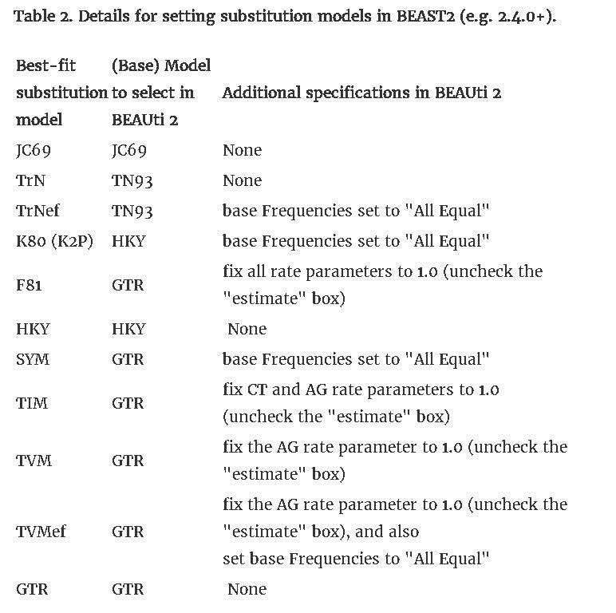

# Session 7: State-of-the-art phylogenetic methods

## Goals 
+ Test which substitution model works better with our data
+ Work with IQTree and learn how to extract information from its output
+ Understand substitution models and how to export them between tools
+ Run a basic model in BEAST
+ Create phylogenetic trees meaningful for our project's question

## Input
+ Aligned sequences of the complete mitochondrial DNA and CytB that we curated on Lab 6

## Output(s)
+ IQTree file with relevant info on our analysis
+ Several tree files 

## Tools
+ Maximum Likelihood  program: [IQTree](http://www.iqtree.org/)
+ Bayesian Phylogenetic Inference program: [BEAST](https://www.beast2.org/)

## Details

For this Session, we are going to use the files that we created in the previous one. Make sure you followed the instructions properly and that you have all the files located. 
For our project, we are going to use an implementation of the Maximum Likelihood approach called [IQ-TREE](http://www.iqtree.org/doc/Tutorial#first-running-example). This software offers several methods to speed up the analysis. 

As we mentioned earlier, any Maximum Likelihood approach is based on a substitution model. In phylogenetics, this model describes the probability of each substitution (or mutation) to happen. [Here](http://evomics.org/resources/substitution-models/nucleotide-substitution-models/) you can find a list of the more common models, and [here](http://www.iqtree.org/doc/Substitution-Models) the ones that are implemented in IQ-TREE. 


*Graphical representation of some substitution models from Yang & Rannala, 2012. Nature Reviews Genetics: https://doi.org/10.1038/nrg3186*

Now that we have a small picture of what we are doing, lets start working with IQ-TREE. The basic syntax for this software is:

```
iqtree -s ALIGNMENT -o OUTGROUP -m MODEL -pre OUTPUT_PREFIX -bb 1000
```

Under OUTGROUP you should put the name of your outrgroup as they appear in the alignment file. If you have multiple outgroups you can separate them with a comma (no spaces!) eg;

```
-o c_Vurs,H_sap

```

Now run IQ-TREE in your interactive session with the CytB data, and set your model to *-m MFP*. *MFP* stands for ModelFinder Plus, and is an algorithm that automatically considers a list of substitution models and estimates which is the one that fits our data better. *-bb 1000* means that we want our algorithm to use [bootstrapping](https://en.wikipedia.org/wiki/Bootstrapping_(statistics)).Remember to adapt the code above to run IQ-TREE  and be careful to not over-write your files. 

All the questions below refer only to the CytB output.

#####Question 1: 
**Which files do IQ-TREE output? Explain briefly what each of them is.** 
#####Question 2:
**IQ-TREE creates several tipes of trees. Compare the *.bionj* tree with the ML tree. Are there any differences? If so, explain what they are and why do you believe they are there.**

Now let's look at the *.iqtree* file. 

#####Question 3:
1. **Which model did ModelFinder choose? From all the criteria calculated by this software, which was used to determine the best-fitting model?**

2. **Briefly explain the best-fitting model.**

### Step 2:
BEAST2 is a program for doing Bayesian phylogenetic analysis. The program uses a Markov Chain Monte Carlo (MCMC) method for exploring the parameter space in a stepwise fashion. Each new step is either accepted or rejected based on the change in likelihood. The posterior probability for each parameter is based on the frequency with which the parameter values are observed.

The first step is to decompress it.

`tar fxz ./SRC/BEAST.v2.6.7.Linux.tgz`

To start BEAST2 apps, type

`PATH_TO_BEAST_FOLDER/beast/APP`

BEAST2 uses different GUI apps for the different steps, so we will need to change
the name of the app accordingly.


Its input files are in the NEXUS or FASTA alignment format. You will work on your own two datasets (in nexus format). The first step is to create an XML file with the settings for our BEAST run. This is done with BEAUTi

`./SRC/beast/bin/beauti`

Once the new window pop up, you have to import the alignment file. You can do it from the *File/ Import Dataset* menu or by clicking in the "+" symbol in the lower left corner.
Once you have the alignment loaded, we need to specify the settings we are going to run BEAST with. BEAUTi offers a lot of different options, and we can even subdivide our alignment to apply different models to different regions, estimate split times, etc.

However, as we are only interested on reconstructing the phylogeny of our sequences, we are going to modify only a few of the settings.
The first one is the Evolution Model, which can be done through the Site Model tab. As we are going to use the same model IQTree selected, and BEAST only have integrated models for JC69, TN93, HKY and GTR, you may need to modify one of these to adapt it to your actual model. This can be done by modifying the XML file (explained here: https://beast.community/custom_substitution_models) or from BEAUTi by following this table (source: https:// justinbagley.rbind.io/2016/10/11/setting-dna-substitution-models-beast/)



If your model has some other letters, like "+I" or "+R", you can find what they mean here: http:// www.iqtree.org/doc/Substitution-Models and modify the settings accordingly.
Once we have everything set up in the Site Model, we move to the Priors tab, select Calibrated Yule Model, and as a birth rate a Gamma distribution with an Alpha (shape) of 0.001 and a Beta (scale) of 1000.
The last step is to go to the MCMC tab to specify how many steps the MCM chain will take before stopping. This should be set to, at least, 100000.
Once this is done, we can save the XML file and close BEAUTi.

Once we have our XML file, we can run BEAST2. Once the window pop, select the XML file, set a
random seed (keep seeds consistent for reproducibility) and check the "Use BEAGLE library if
available". This last step will make your analysis faster.
Then click on "Run" to start.

Once your analysis is done (it may take a while), we can visualize it through different approaches.
BEAST creates a posterior sample of phylogenetic "time-trees", which need to be summarized in some
way before we can check the quality of the posterior estimate.
This can be done in 2 ways with the software included with BEAST2:

• TreeAnnotator: this program looks inside the "forest" of trees estimated by the MCMC to find the best supported version and then it will annotate it with the best supported estimates for ages of the nodes in the tree. It will also calculate de posterior clade probability for each node, which is usefull as a measure of certainty in the depicted division. We start by oppening TreeAnnotator and setting up the Burning rate to 10% and the Posterior Probability Limit to 0. Then, we have to choose the Target tree type, so we will select "Maximum clade credibility tree" (aka MCC tree), and them "Mean Heights" from the Node Heightsmenu. Finally, we select our input and output files (for the output, just write the name, our it will force you to overwrite an existing file). Once we have out tree annotated, we can visualize it with FigTree.

• DensiTree: an alternative to visualizing the MCC tree, this program allows us to visualize all the estimates at the same time. This means we don't need to annotate the tree file.

Use both methods to visualize your results, and compare the FigTree representation with your results from the Maximum Likelyhood analysis. 

#####Question 4: 
**Which setup did you use in BEAST2?** 

#####Question 5: 
**Does the DensiTree and FigTree plots agree on the results?**

####OPTIONAL:
BEAST offers many other options and tools to be sure our estimates are appropriate that were left out from this tutorial because the fall out of our scope, but if anyone is interested, you can check the tutorials in the software webpage or this great introduction https://taming-the-beast.org/tutorials/Introduction-to-BEAST2/


# REPORT

Submit a file with the answers to all the questions and the *.iqtree* file for the CytB run. 

