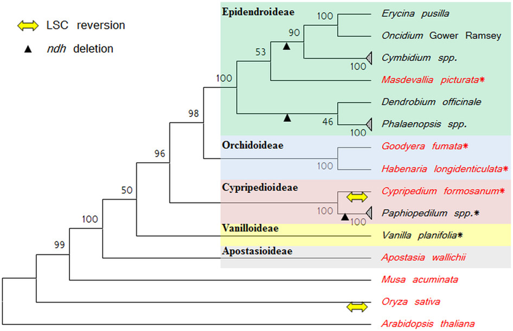
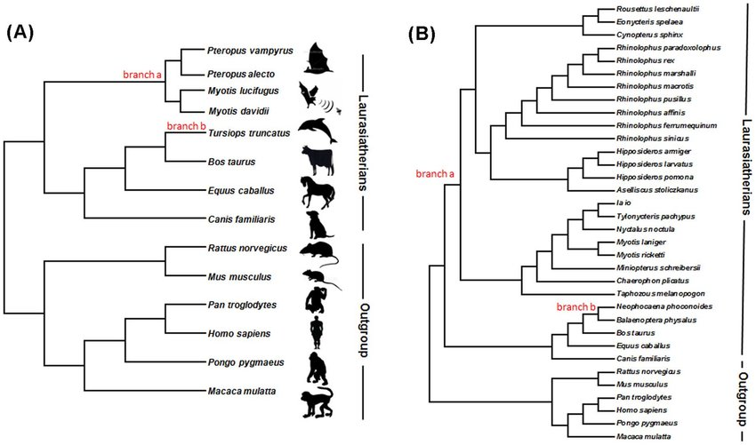
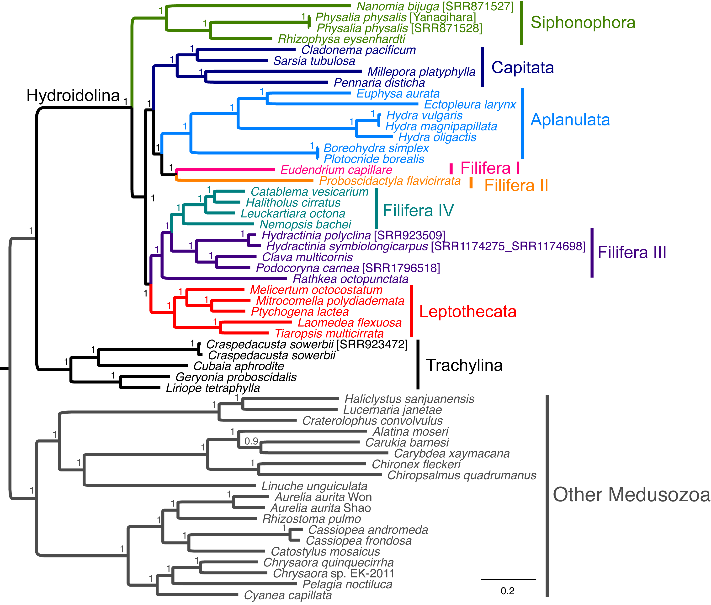
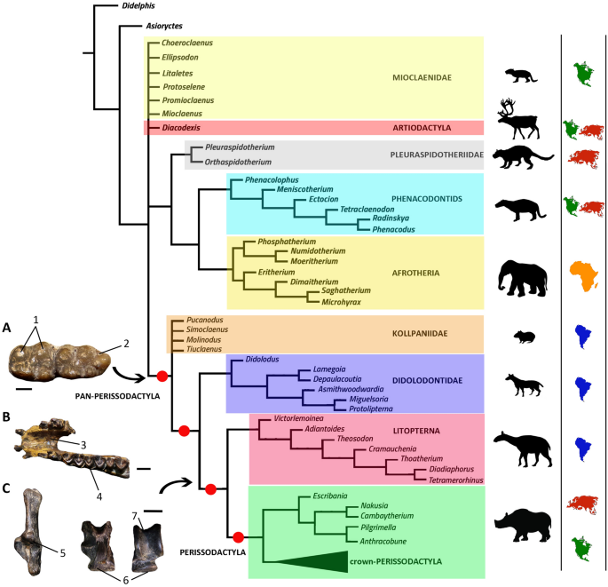

# Session 8 - Wrap-up the bioinformatics project

## Introduction / Background information to session 8

This is the last session of the bioinformatics project (and of the course). You will wrap-up the project and present your results to the teaching assistants (details below).

## Goals

  + Further your understanding of your results
  + Plot trees with a visualization software
  + Answer the question you were given in Session 5
  
## Input(s)

  + The trees generated in Sessions 6 and 7
  + The name conversion tables generated in Session 5

## Output(s)

  + .pdf files of your trees

## Tool(s)

  + FigTree, a phylogenetic tree visualization software
  + DensiTree

## Details

### Step 1: Run the BEAST2 analysis on the MT data
Repeat the steps followed on Session 7 to run BEAST2, but this time use the mitochondrial alignment instead. This is going to take some time, so move to the next step once BEAST2 is running.

### Step 2: Examine the IQTree and BEAST2 outputs for the mitochondria

In Session 7 you performed a Maximum Likelihood and Bayesian analysis  on two alignments: *cytB* and entire *mitochondria*. You answered  questions relative to the *cytB* run. Now, answer these same questions for the mitochondria run. You might be asked about these during the presentation.

#####Question 1:
**Which files do IQ-TREE output? Explain briefly what each of them is.**
#####Question 2:
**IQ-TREE creates several tipes of trees. Compare the *.bionj* tree with the ML tree. Are there any differences? If so, explain what they are and why do you believe they are there.**

Now let's look at the .iqtree file.

#####Question 3:
1. **Which model did ModelFinder choose? From all the criteria calculated by this software, which was used to determine the best-fitting model?**

2. **Briefly explain the best-fitting model.**

#####Question 4:
1. **Now look at both your Maximum Likelihood tree and Consensus Tree. Are they the same? If not, where do they differ?**

2. **In both trees you can see a number at the base of each branch. That is the number of iterations that supported that branching during bootstrapping. Which is your least supported branch? What does that mean to your question?**

### Step 3a: Create a visual representation of your  Neighbour Joining and Maximum Likelihood trees

In the .iqtree file, you have a representation of the trees. However, it is an unrooted tree. You can root the tree, and do many other things, with the program FigTree.
  
When you call FigTree, a visual interface will open. In `File`, choose `Open` and select one of your Maximum Likelihood trees. If the software asks you to select a name for the labels on the tree, you can keep the default or choose a keyword, for example `bootstrap`. **Note that you do *not* want the `.iqtree`, that file is more of a logfile than an actual tree.**

The three important things you have to do are:
  
  1. Root the tree with your outgroup (select the branch and then select `Reroot`)
  2. Show the bootstrap values (using `Branch labels` or `Node labels` and selecting the right value to display)
  3. Make sure the tree can be easily understood. For example, you might need to change the name of the species, if you are using the short names that you created in [Session 6](Lab6.md). 

You can use the script we used in Session 6 to change the names in your treefiles.
Once you are done with those, you can play around with the other options (for example Rotate & Different type of trees).

Before you export your tree, think on what else you can do to show your results better. Look on Google for actual published trees, like this ones.
 

	
	
	
	

	

### Step 3b: Create a visual representation of your Bayesian Inference trees

Once your analysis is done (it may take a while), we can visualize it through different approaches. BEAST creates a posterior sample of phylogenetic "time-trees", which need to be summarized in some way before we can check the quality of the posterior estimate.

This can be done in 2 ways with the software included with BEAST2:
• TreeAnnotator: this program looks inside the "forest" of trees estimated by the *MCMC* to find the best supported version and then it will annotate it with the best supported estimates for ages of the nodes in the tree. It will also calculate de posterior clade probability for each node, which is useful as a measure of certainty in the depicted division. We start by opening `TreeAnnotator` and setting up the *Burning rate* to 10% and the *Posterior Probability Limit* to 0. Then, we have to choose the
*Target tree* type, so we will select "Maximum clade credibility tree" (aka MCC tree), and them "Mean Heights" from the Node Heights menu. Finally, we select our input and output files (for the output, just write the name, our it will force you to overwrite an existing file). Once we have out tree annotated, we can visualize it with *FigTree*.
You can run TreeAnnotator with this command:
`treeannotator`
Try to follow the same guidelines as with the *iqtree* output. 

• DensiTree: an alternative to visualizing the MCC tree, this program allows us to visualize all the estimates at the same time. This means we don't need to annotate the tree file. DensiTree can be called with this command:
`densitree`
Use both methods to visualize your results, and compare the FigTree representation with your results from the Maximum Likelyhood analysis.

**Do not forget to export your trees as `.pdf`. You will have to show them during the presentation.**

### Step 4: Reflect on your results

By now you have assembled a dataset to answer the question from Session 5; you collected *cytB* sequences and entire mitochondrial genomes for all species in the dataset; you aligned the species; you performed Maximum Parsimony, Neighbour Joining, Maximum Likelihood and Bayesian Phylogenetic analysis and looked at some aspects of it, for example the model chosen; and you obtained a visual representation of your rooted trees.

Now it is time to reflect on all that you have done and to answer your phylogenetic question. The preferred method for that is to do it orally during Session 8. If for some reason this is not feasible, you will have to do it in a written form (details for the format are below).

At this stage, you should have two sets of trees: one for *cytB* and one for the entire mitochondria. If you want, you can also look at the *consensus trees*. To prepare for the presentation, think about:

- What is the answer to the question given by these trees?

- Do the different trees give the same answer? If not, what could be the explanation?

- Which tree(s) do you think are most supported? What does the bootstrap analysis tell?

- Are the substitution models different for *cytB* and the entire mitochondria? If yes, what could be an explanation?

- Do you think your choice of species (including the outgroup) was appropriate to answer the question? If you were to redo the analysis, would you change something?

We will also expect you to remind us briefly of the question you worked with, and list which species you chose to include and why, so take a moment to prepare that too.

---
## Presentation

Once you feel like you are ready to present (and not later than one hour before the end of the session), write your names on the board so the teaching assistants can come to listen to you. The presentation will last 5-10 minutes, at your desk.

You do not have to submit anything for this session (if you present orally).

---
## Back-up submission: Written report

In case you could not finish in time, please let the teaching assistants know and submit a written document with your trees (the ones you made with FigTree) and 15-30 lines (or more if you are inspired) answering the questions in **Step 3**. Do not forget to indicate which question you worked with and which species were included in the dataset. Exceptionally one submission by group is allowed - but remember to state the people involved.

---

This is the end of the lab, please make sure that you completed and wrote down the answers to all of the questions.
Also, make sure to delete any files that you no longer need - you can copy them somewhere else if you want to keep them.

 **Obs!** As this is the last session, this step is extra important. We won't delete anything before the end of the semester, but afterwards we do not guarantee that the data will be kept. 
