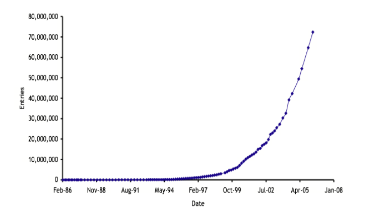
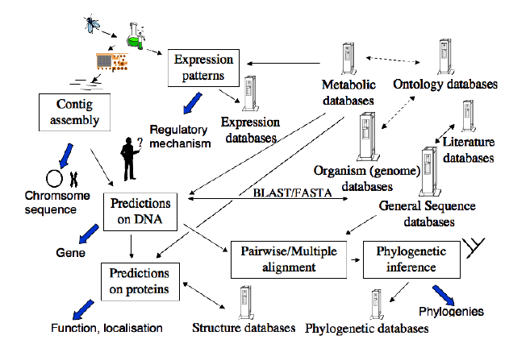
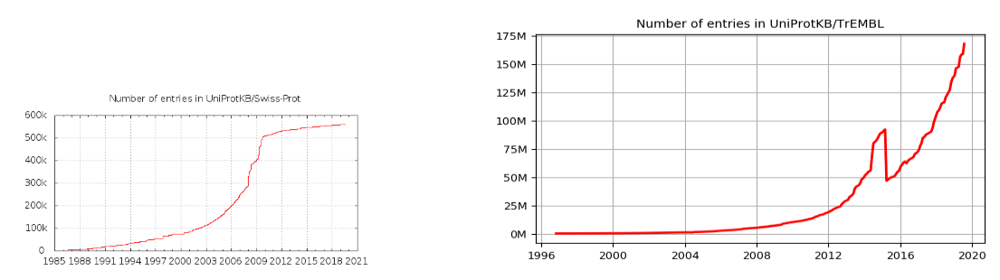

# Introduction to biological databases

##Introduction

Most biologists who are not bioinformaticians would think of databases, particularly sequence databases, when they hear the word Bioinformatics. And without the potential that lies in the public sequence databases, the surge in (or actually the emergence of) the bioinformatics field in the late 1990-ties would had been very different.
Figure 1 shows the number of entries in the first public sequence databases, EMBL. The increase in available data makes the resource more useful in itself, but also drives the need for better tools (read software) to handle and analyze the data.

Figure 1: The number of entries in the EMBL sequence database.

The ability to access data of different kinds, from different studies, through databases and combine them to be able to make new inferences is indeed one of the cornerstones of bioinformatics.

## What do we meand with a database?

The word database can refer to different things, and depending if you are mainly a biologist, bioinformatician, or a computer scientist the first things that comes to mind when you hear the word may differ. So, database can refer to

* the data (information) itself used for a particular study or conclusion, then usually written separated as "data base" (e.g., the sequences analyzed in a study)
* a particular collection of data made available in some specific way (e.g., GenBank)
* the structure of how the information is organized, which can be as
	* flat-files; plain text files, usually combined with
		* some kind of mark-up, such as XML
		* indexing, keeping track of where in a file something can be found
	* relational databases, consisting of tables containing records (rows), each with values in fields (columns), and where key fields are used to relate the information in different tables
	* object oriented databases, with is-a or has-a relationships between objects
* the database management system (DBMS), which is the software that enables us to handle and query the database (e.g., mySQL, which is a relational DBMS)
* interfaces, which may be
	* user interfaces, such as web pages, to let the user interact with the store information
	* computer interfaces, to let computer programs harvest the data and combine it to make new inferences

It is common among biologists to use the interface as a token for the database; e.g., when describing where they retrieved the sequences used in an analysis, they may say that it is data from Entrez (see below). Entrez, however is the interface through which, for example, GenBank (see below) may be accessed - but also several other source of data, and thus the statement is ambigous. So, when referring to the source of sequences used, one should rather refer to the authority of the collection of the data, in this example GenBank (corresponding to the second item above).

One of the most important things is the ability to gather relevant data from different databases and to use all the available data to draw new conclusions. That is why the key fields are important - the content of a shared field in two different databases can be used to relate the records in them. An example of a key field would be the species name; this is probably present in most biological databases, so we can extract information pertaining to a particular species.

##Different types of databases
####Repositories and curated databases
One distinction is the one between databases that are repositories and those that are actively curated. A repository is a database which (usually) contains primary data from experiments, and the information is usually provided by the scientists doing the experiments. After an initial check at submission, the authority that manages the database does not tend to it in any way (except when errors in the data is discovered by users and pointed out to the database authority). A repository is simply a way to make a lot of data from experiments publicly available. An example of a repository is the GenBank sequence database (see below). A curated (managed) database on the other hand, contains information that is actively groomed by the database authority, continuously updated with additional information (found in other sources by the database authority), and is more of a work in progress. This also implies that the data in a curated database is less likely to contain errors. An example of a curated database is SwissProt (see below).

One should always be critical to the information in the databases - it is certainly not free from errors. If we think about sequence databases, this can be errors in the sequence itself (the primary data), or errors in the annotations (additional info given about the sequence). Both these kinds of errors, but particularly errors in the annotation, are much more likely in a repository than in a curated database, since errors are continuously discovered and purged in the latter. An observation that is worth remembering is also that sequence data produced before the 1990-ties in general has more errors than more recent data (due to technological progress).

####Primary and secondary databases
Another distinction is between databases that contain primary data, i.e. data that are produced in experiments or observations, and those that contain secondary date, which are data that have been produced by some kind of computation or analysis of primary data. In many cases we find that primary databases are also repositories and secondary databases are curated databases, but this is not always the case. The two examples above (GenBank and SwissProt) are examples of primary and secondary databases that are repositories and curated, respectively, but for example TreeBase, which contains data sets and results from phylogenetic analyzes can be viewed as a repository of secondary data.

##Some example of biological databases with different contents

Figure 2. A schematic overview of some bioinformatics activities in a genome project. Note that databases play an important role in many, if not all, of these.

##Structure databases
These databases contain information about secondary structure, mainly of proteins, but also some other macromolecules. The information mainly comes from x-ray crystallography or nuclear magnetic resonance scans (NMR). These will be covered in more detail in Bioinformatic analyses IIb.

Table1: some examples of publicl available structure databases
|  Designation   | Description    |  URL   |
| --- | --- | --- |
|  PDB   |  Protein DataBase   |  http://www.rcsb.org/pdb/   |
|  MMDB   | Molecular Modeling Database, NCBI structure database    |   http://www.ncbi.nlm.nih.gov/entrez/query.fcgi?db=Structure  |

## Expression Databases
Expression databases are composed of data from experiments where the RNA levels of many different genes have been monitored using micro arrays. Even though the micro array data can be stored in a fairly standardized form, these databases contain very heterogeneous data since the nature of the experiments can be very different.

|  Designation   |  Description   |  URL   |
| --- | --- | --- |
|  EBI Array Express   | EBIs expression data repository    |   http://www.ebi.ac.uk/arrayexpress/  |
|  KEGG Expression   |  KEGG Expression Data Analysis   |  http://www.genome.ad.jp/kegg/expression/   |

##Phylogenetic DataBases
Phylogenetic databases contain the outcome, and sometimes the data used, from analyses of phylogenetic relationships - usually this is in the form of phylogenetic trees. This presents some special problems how to store and search the data. These will be studied in more detail in Bioinformatic analyses IIa.

| Designation    |  Description   |   URL  |
| --- | --- | --- |
|  TreeBase   | TreeBase contains data sets used in phylogenetic analysis and the resulting trees    |  http://www.treebase.org/treebase-web/home.html   |
|  ToL   |  Tree-of-life project, builds a supertree of collected phylogenetic trees   |  http://tolweb.org/tree/phylogeny.html   |

## Metabolic DataBases
Metabolic databases hold data on enzymes, reactions, substrates, products, and biochemical reactions that occur in different organisms. Data are usually specific for the organism ("type organisms”), but general overviews ("composite organisms”) are also incluede. The main metabolic database is KEGG - the Kyoto Encylopedia of Genes and Genomes (http://www.genome.ad.jp/kegg/). This will also be covered in more detail in Bioinformatic analyses IIb.

##Literature databases

Literature databases are so common that most people would not consider them "bioinformatics", but this is an important resource to correlate information. As more and more of the literature is published as full-text electronic journals, there is a lot of information available here, and several projects attempt to extract new information, for example by observing how frequent two different gene names occur together in what is published (the underlying idea being that if researchers have found reasons to report them together, regardless of what the study is, there is probably some functional connection). We will not cover literature databases explicitly in these courses, but I suggest that you take a look at PubMed at http://www.ncbi.nlm.nih.gov/sites/entrez?db=PubMed and get acquainted with the database if you are not already familiar with it.

##Ontology databases
An ontology in this context is basically a controlled vocabulary, or a collection of clearly defined terms that are used in, for example, annotation of genome sequences. So in a sense it is a kind of meta-database; meta data is data that is used to manage the "real" data. The purpose is to establish a common ground, so when you try to correlate information from different databases, terms are used in a consistent manner (e.g., homologous genes have the same names in different genomes). An example of an ontology database (as well as tools for using it) is the Gene Ontology Consortium database (http://www.geneontology.org/), which aims to provide a controlled vocabulary relating to genes across different organisms.

##Organismal (speciality) databases
These databases (almost always curated, and most often secondary) provides information of many different kinds that in common only have that they are from one particular organism, such as Dropsophila melanogaster, Homo sapiens or Caeonrhabdidtis elegans. The idea is in general to have a source of curated and highly reliable data for type organisms that are widely used in different kinds of studies.

|  Designation   | Description    |  URL   |
| --- | --- | --- |
|  FlyBase   |  Fruitfly *Drosophila melanogaster* database  |  https://flybase.org/   |
|  Saccharomyces Genome Database (SGD)   |  Budding yeast *Saccharomyces cerecisiae* database   |  https://www.yeastgenome.org/   |
|  WormBase   |  Nematode database with a focus on *C. elegans*.    |   https://wormbase.org//#012-34-5  |
| The Arabidopsis Information Resource (TAIR)    |   Arabidopsis thaliana  |   http://www.arabidopsis.org/  |
|   Mouse Genome Database (MGD) and Gene Expression Database (GXD)  |   mouse Mus musculus  |   http://www.informatics.jax.org/  |
|  Rat Genome Database (RGD)   |  rat Rattus norvegicus   |  http://rgd.mcw.edu/   |

##Sequence Databases
These are the focus of the databases treated in this course, and are described in more detail below. Note, however, that these databases (as is the case for many of the other as well) are constantly and rapidly evolving, so for up-to-date details you will need to consult the official web pages of the databases themselves.

It is worth mentioning here that there are some resource that holds sequences from completely sequenced genomes, as well as information on how these are physically related to each other on the chromosomes.

The publicly available sequence databases can be divided into two groups
* Nucleotide (DNA/RNA) sequence databases
	* are repositories for primary sequence data, i.e., the sequences are the results of some kind of sequening
* Protein sequence databases
	* comprises both repositories and curated databases, but the sequences are usually secondary data, i.e., they are computer translations from the primary DNA or RNA sequence, even though some primarey sequence data may also exist in these databases
#### Nucleotide sequence repositories

There are three primary centres (below) that handles deposited sequence data, but these exchange information on a daily basis so in principle each centre should provide a complete set of entries. This is not alway the case however, so it may be worth doing a search in each of them if you are trying to assemble a complete dataset. All three adhere to the agreed DDBJ/EMBL/GenBank Feature Table Definition, a standard to annotate features in the sequence, so the information is standardized over the three centres, albeit there are some differences in the file format (but the interfaces you have available to access the databases let's you save the data in several different formats). You can see the complete definition at http://www.ebi.ac.uk/embl/Documentation/FT_definitions/feature_table.html.
The main source for the data in these databases are from deposition from scientists and groups producing sequence data in their research (which can be of any kind), but also big genome sequencing projects contribute large amounts of data, as do patent applications.

#### EMBL-European Molecular Biology Laboratory
This is Europe's primary nucleotide sequence resource, and is the oldest - it was established in Heidelberg 1980, but now resides in Hinxton, outside Cambridge, UK. The EMBL file format uses two-letter tags to indicate what kind of information that follows on the line.

####DDBJ - DNA Database of Japan
Mainly collects data from Japanese activities (but, as the other, accepts data from any country). It started as a DNA repository in 1986, endorsed by the Ministry of Educations, Science, Sports, and Culture. Uses GenBank data format.

####GenBank
The GenBank (NB! not GeneBank) is to many bioinformatics manifested in a single activity. It is the US primary nucleotide sequence resource, and was not established until 1988. It is situated at the National Centre for Biotechnology Information (NCBI) in Bethesda, MD, on the northern outskirts of Washington, DC.

####Submitting data to the nucleotide repositories
Most journals require that sequence data used in a study is submitted to one of the three repositories, so the author can receive accession numbers for the sequences to appear in the publication. The three organization have adopted a common process for accepting and handling submissions of data. For simpler submissions (single sequences) there are web-based interfaces
* DDBJ uses Sakura (http://sakura.ddbj.nig.ac.jp/)
* EMBL has its wEBIn (http://www.ebi.ac.uk/ena/submit/sequence-submission)
* GenBank uses BankIt (http://www.ncbi.nlm.nih.gov/BankIt/)
For more extensive submissions, there is a batch process using the application SequIn (used for all three repositories); the submission are then prepared locally and the entire set of sequences submitted when it is ready. You can download SequIn from ftp://ftp.ncbi.nih.gov/sequin/.

####Protein sequence databases
Until 2003 there were three main resources or protein sequence data
* Swiss-Prot, managed by the Swiss Institue of Bioinformatics (SIB), a curated databases that aimed to provide a high degree of annotation of various kind (such as post-translational modifications)
* TrEMBL, managed by European Bioinformtics Institute (EBI), built by translating protein coding sequence deposited in the EMBL nucleotide database
* PIR-PSD, or the Protein Information Resource, located at the Georgetown University Medical Centre (GUMC), which also aimed for a high degree of annotations
In 2002, SIB, EBI, and GUMC was granted funding to merge their resources into a common resource, the [UniProt](http://www.uniprot.org/).

####UniProt
UniProt was commissioned in December 2003, and is an consolidation of the databases Swiss-Prot, TrEMBL, and PIR-PSD, albeit the three resources are still visible within the UniProt. It consists of three major parts
* the UniProt Archive (UniParc), into which new and updated sequences are added daily
* the UniProt Knowledgebase, which extends the effort originally done in Swiss-prot, TrEMBL, and PIR-PSD, with the goal to provide an expertly curated database
* the UniProt non-redundant reference database (UniRef) which provides non-redundant views of the data in the two previous items

####UniParc
Although the bulk of protein sequence data is derived from translation from DDBJ-EMBL-GenBank sequences, a fair amount of primary protein sequence data was submitted directly to other sources (such as Swiss-Prot), found in patent applications, or in PDB. Given all these sources and the varying quality of the data and annotations, UniParc was launched with the aim to capture all available protein sequence data from a variety of sources (Swiss-Prot, TrEMBL, PIR-PSD, PDB, IPI, RefSeq, FlyBase and WormBase), which makes it the most comprehensive, publicly available, non-redundant protein sequence database. The entries are flagged, based on the status of the source database, as "active" (=still in the source database) or "obsolete" (=removed from the source database). The primary use is for sequence similarity searches (treated further in Searching sequence databases for homologous sequences), and UniParc entries carry no annotations (but can be found in the source databases).
Note that [UniParc](https://www.uniprot.org/uniparc/) (as well as UniProtKB) is non-redundant - each sequence is represented once, and only once. This means that identical sequences from the different source databases are merged into one entry, regardless if they come from different species. This makes the databases useful for finding entries in other databases that refer to the same identical sequence.

####UniProt Knowlegebase
This database do carry information on annotations. It contains two main sections: one containing entries that have been manually annotated based on literature and evaluated computational analyses, and one section with computer analyzed entries, still awaiting manual annotations. The former corresponds, and is also referred to as Swiss-Prot, whereas the latter are referred to as TrEMBL. In addition, all entries found in PIR-PSD that are not in Swiss-Prot or TrEMBL are also incorporated. The effect of this difference (being one between a curated database and a repository) can be seen in the number of entries they contain (figure 3).

Figure 3. The number of entries in Swiss-Prot and TrEMBL over time. Note that the difference in scales, and that the manually annotated Swiss-Prot grows much more slowly.
